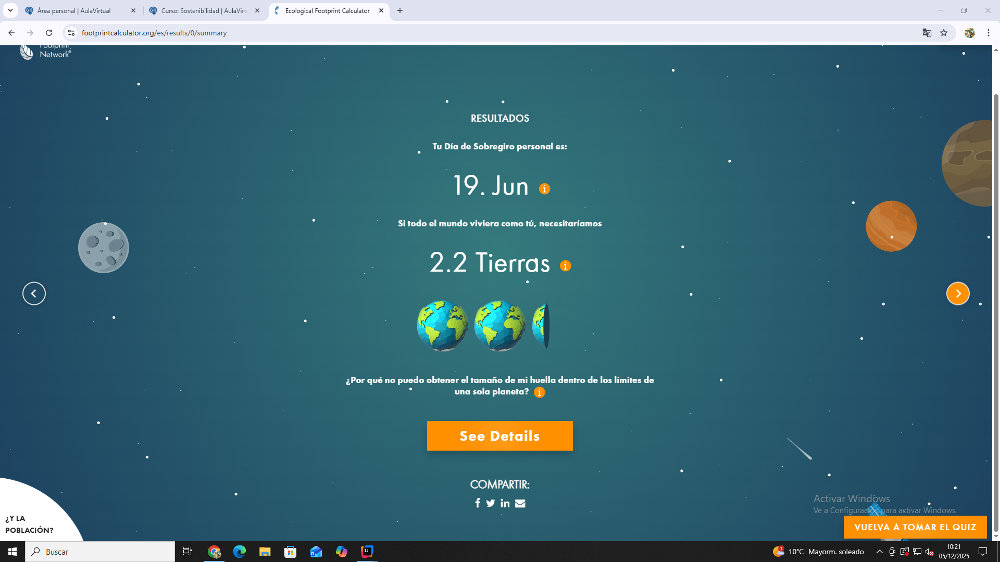
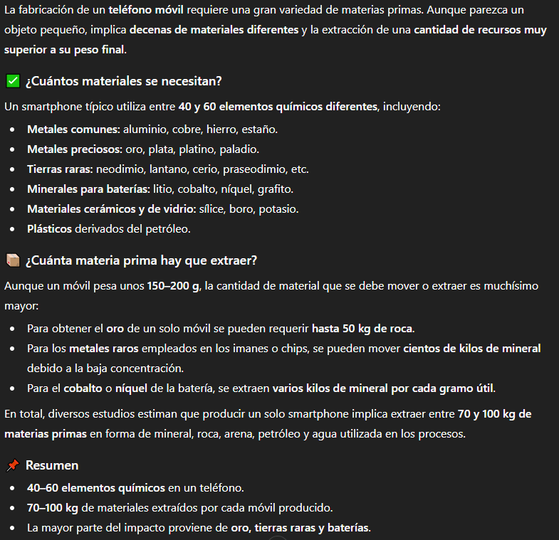

# Sostenibilidad

## Índice
- [Enero](#enero)
- [Diciembre](#diciembre)
- [Noviembre](#noviembre)
- [Octubre](#octubre)
- [Septiembre](#septiembre)

## Enero
**Clases de enero:**
- [Clase 14 — 23/01/2026](#clase-14--23012026)
- [Clase 13 — 16/01/2026](#clase-13--16012026)
- [Clase 12 — 09/01/2026](#clase-12--09012026)
### 23/01/2026, Clase 14:
### RESUMEN
En clase hemos visto los planes de sostenibilidad empresarial. En un plan de sostenibilidad empresarial se busca la sostenibilidad de los intereses de esta.  
### PREGUNTA
La pregunta de hoy es: "¿Los planes de sostenibilidad son Greenwashing?".
### RESPUESTA
No creo que sean Greenwashing, pero lo que sí creo es que algunas empresas lo aprovechan para hacerse un lavado de cara y que los consideren ecofriendly.
### IMAGEN

### 16/01/2026, Clase 13:
### RESUMEN
No asistí a clase. Mis compañeros me han dicho que el tema del día fueron los ODS.  
### PREGUNTA
La pregunta del día fue: "¿Crees que se van a cumplir los ODS?".  
### RESPUESTA
Creo que se podrían cumplir algunos, ya que muchos países están involucrados en la participación de estos. Igualmente, objetivos como acabar con la pobreza me parecen imposibles si seguimos viviendo en el sistema actual.
### IMAGEN

### 09/01/2026, Clase 12:
### RESUMEN
Hoy en clase hemos hablado de la contaminación y de los residuos. Hemos debatido el concepto de residuo, lo que me ha llevado a replantearme el concepto que yo tenía por residuo.  
### REFLEXIÓN PERSONAL
Yo por residuo tenía como concepto cualquier cosa que tirásemos a la basura, pero ahora pienso que un residuo es algo que se descarta, lo que no implica que se convierta automáticamente en algo inútil, sino que en otro contexto o punto de vista pueda tener otro valor o utilidad.  
### PREGUNTA
La pregunta de hoy es "¿Por qué cambias de móvil?".  
### RESPUESTA
Mi respuesta es que únicamente cambio de móvil cuando este ya no funciona o funciona muy mal, y casi siempre que los cambio son de segunda mano. Mi último móvil fue cambiado porque se me cayó a una piscina y dejó de funcionar.
### IMAGEN

## Diciembre

**Clases de diciembre:**
- [Clase 11 — 12/12/2025](#clase-11--12122025)
- [Clase 10 — 05/12/2025](#clase-10--05122025)

### 12/12/2025, Clase 11:
### RESUMEN
En la clase de hoy hemos hablado sobre el cambio climático y todos sus impactos.  
### REFLEXIÓN PERSONAL
Cada año tenemos sus efectos más presentes, y en mi opinión en vez de ponerle freno e implantar medidas bruscas echamos más leña al fuego, por ejemplo con la sobreproducción de productos que no son de primera necesidad o el uso de la IA o criptomonedas, que provocan un efecto negativo en el cambio climático.  
### PREGUNTA
Las dos preguntas de hoy son "¿Cuál es el principal emisor de CO2?" y "¿Qué hago yo como programador para combatir el cambio climático?".
### RESPUESTA
El principal emisor de CO2 es la quema de combustibles fósiles, que es con lo que generamos energía, el uso del transporte y los procesos industriales.  
Yo, como programadora, para combatir el cambio climático puedo realizar pequeñas acciones como reducir o eliminar el uso de IA para programar u optimizar mis programas para que gasten menos recursos.
### IMAGEN

### 05/12/2025, Clase 10:
### RESUMEN
Hoy en clase hemos visto la huella ecológica y la huella de carbono que tiene nuestro planeta.  
La huella ecológica es la diferencia entre lo que consumimos contra lo que se puede regenerar y la huella de carbono son los gases de efecto invernadero que se generan.
### PREGUNTA  
Para conocer la nuestra hemos realizado un test en la página de footprintcalculator.org.
### RESPUESTA
Mi resultado en la encuesta intentando responder de forma sincera ha sido este:
### IMAGEN

## Noviembre
**Clases de Noviembre:**
- [Clase 9 — 28/11/2025](#clase-9--28112025)
- [Clase 8 — 14/11/2025](#clase-8--14112025)
### 28/11/2025, Clase 9:
### RESUMEN
Hoy hemos hablado de la economía lineal y circular. El modelo de la economía lineal se basa en la producción y en desechar sin pensar en la consecuencia de los residuos, y la economía circular se basa en la producción y reutilización de los desechos.  
La economía circular es el método económico que busca la sostenibilidad, ya que en esta se busca y se prioriza la reutilización, y además el uso de materiales biodegradables.  
### PREGUNTA
La pregunta de hoy es "¿Y a mí qué me cuentas?, ¿enfoque colectivo o individual?", y mi respuesta es:
### RESPUESTA
En mi opinión a esta situación es que habría que darle un enfoque colectivo, ya que si como sociedad no nos movilizamos y cambiamos las cosas, individualmente no conseguiríamos los objetivos de la economía circular, aunque sí que pienso que yo como individuo también me tengo que concienciar.
### IMAGEN

### 14/11/2025, Clase 8:
### RESUMEN
Hoy hemos analizado el ciclo de vida, el cual su proceso consiste en conseguir materiales a través de las fuentes de energía que nos ofrece el planeta.  
Con este proceso fabricamos diversos productos, como el teléfono móvil del que hemos estado hablando en clase, y en este la cantidad de desechos que genera es mayor a la cantidad de materiales que se requieren para su fabricación (peso oculto).  
### REFLEXIÓN PERSONAL
Mi opinión de todo esto es que aunque poco a poco en algunos de estos procesos se utilice la economía circular, en la cual se busca optimizar el uso de los recursos y no desecharlos, aún se sigue utilizando la economía lineal, que produce sin preocuparse en los desechos producidos y no cumple los principios de la sostenibilidad, lo que nos hace desperdiciar los recursos del planeta y no nos ayudará a preservarlo el mayor tiempo posible.
### PREGUNTA
La pregunta que le he realizado a mi IA de confianza es "Cuando se fabrica un teléfono móvil, ¿cuántos materiales hay que extraer para obtener su materia prima?", y su respuesta ha sido:
### IMAGEN

## Octubre
**Clases de Octubre:**
- [Clase 7 — 31/10/2025](#clase-7--31102025)
- [Clase 6 — 24/10/2025](#clase-6--24102025)
- [Clase 5 — 17/10/2025](#clase-5--17102025)
- [Clase 4 — 10/10/2025](#clase-4--10102025)
- [Clase 3 — 03/10/2025](#clase-3--03102025)
### 31/10/2025, Clase 7:
### RESUMEN
El tema de hoy ha sido la finitud del universo y los recursos limitados del planeta. 
### REFLEXIÓN PERSONAL
Nuestro consumo crece, pero los recursos no, lo que nos deja en una situación complicada en la que debemos manejar su consumo para conseguir que el planeta viva lo máximo posible, aunque yo pienso que la mayoría de miembros de la sociedad son demasiado egoístas para sacrificar o compartir recursos que ayudarían a disminuir el gasto de estos.  
Numerosas son las cadenas de comida que en vez de donar su comida a causas prefieren tirarla para que su economía no se vea afectada, esto al igual pasa con compañías de ropa que cada año desechan la ropa de la temporada anterior porque ya no sigue la nueva moda, lo que en mi opinión muestra ese egoísmo y ansia por ganar dinero en vez de mirar por nuestro planeta y bienestar, y que cuando esos recursos comiencen a escasear esa economía dejará de importar.  
Además de todo esto hoy hemos introducido el segundo punto de nuestra página web, en el que algunos de mis compañeros han elegido una acción sostenible, incluida yo.
### IMAGEN

### 24/10/2025, Clase 6:
### RESUMEN
Hoy hemos hablado sobre las estrategias de crecimiento de r y K y las diferentes especies que forman parte de una u otra. 
### PREGUNTA
Nuestra pregunta de hoy ha sido el grupo al que pertenecemos los humanos, a la que respondería dejándome llevar por la lógica diciendo que nosotros siempre hemos formado parte del crecimiento K, además sabiendo que un ser humano no puede subsistir por sí solo hasta cierta edad.
### IMAGEN

### 17/10/2025, Clase 5:
### RESUMEN
Hoy en clase hemos hablado sobre si vivimos solos y las relaciones intraespecíficas e interespecíficas. 
### PREGUNTA
La pregunta de hoy ha sido: ¿Qué hacemos nosotros: cooperamos o competimos?  
### RESPUESTA
Respondiendo a esto en mi opinión depende de la situación, el ser humano es un ser social y por eso cooperamos, pero a su misma vez por esa misma razón competimos. No necesariamente la competición tiene que ser algo malo, de hecho yo lo veo como algo bueno, ya que sin esta no innovaríamos ni querríamos mejorar, simplemente nos quedaríamos en nuestra zona de confort y todo sería monótono.
### IMAGEN

### 10/10/2025, Clase 4:
### RESUMEN
El tema que hemos visto hoy en clase ha sido la capacidad de carga del ecosistema y como nuestro sustento tiene límites.
### PREGUNTA
Respondiendo a la pregunta de hoy creo que sí, que puede que tengamos un límite, aunque me gustaría creer que cuando ese límite esté cerca podamos encontrar una solución, como por ejemplo encontrar más recursos en otro planeta. Dicho esto, conociendo cómo nos comportamos los seres humanos siento que volveríamos a esa misma problemática en cuanto los recursos encontrados empiecen a escasear, así volviendo a empezar el mismo ciclo al que está condenada la humanidad.
### IMAGEN

### 03/10/2025, Clase 3:
### RESUMEN
Hoy hemos hablado del ser humano como animal y qué nos diferencia de los demás animales. 
### REFLEXIÓN PERSONAL
Siempre he escuchado que lo único que nos diferencia de los animales es el saber que vamos a morir, pero en mi opinión nuestra diferencia es que nosotros somos animales morales.  
Además se ha debatido si podríamos acabar con toda la vida del planeta, lo cual resultaría difícil, ya que considero que nosotros acabaríamos con nosotros mismos antes que con toda la vida en el planeta.  
Por último en grupo hemos decidido el tema del que realizaremos en el trabajo principal.
### IMAGEN

## Septiembre
**Clases de septiembre:**
- [Clase 2 — 26/09/2025](#clase-2--26092025)
- [Clase 1 — 19/09/2025](#clase-1--19092025)
### 26/09/2025, Clase 2:
### RESUMEN
En clase hemos visto el concepto de la sostenibilidad, la diferencia entre ecologismo y ecología, hemos creado un git y hablado en grupo para decidir qué página web realizar para el proyecto de la asignatura.

### 19/09/2025, Clase 1:
Hoy hemos visto como vamos a realizar la asignatura de sostenibilidad y he creado este repositorio de git para ir actualizandolo semanalmente.

